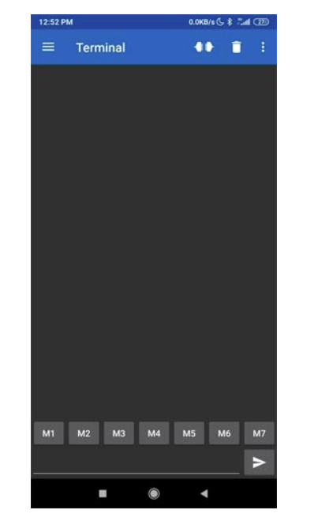
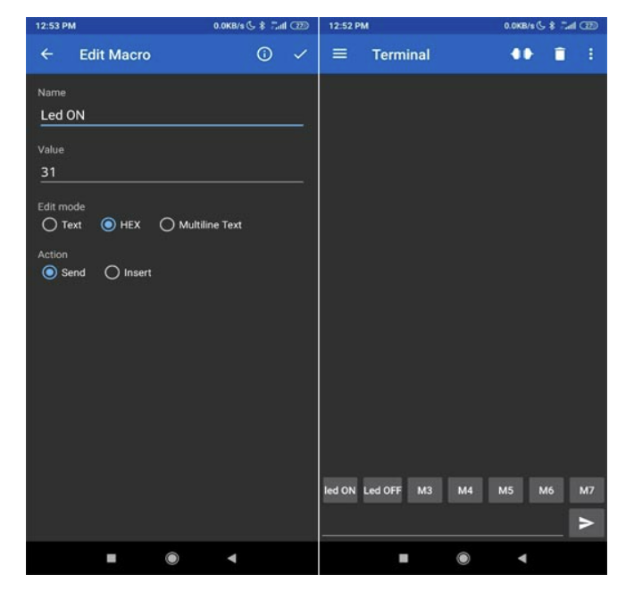
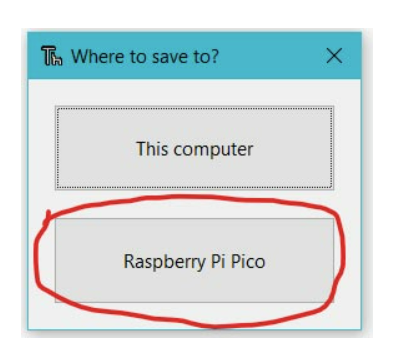
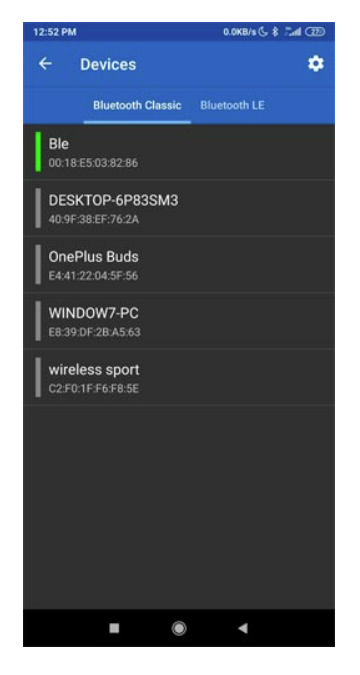

### Procedure

Hardware Setup –

- First, we are connecting GPIO1 that is pin number 2of the pico board
- Receiver pin of Bluetooth module with GPIO0 that is pin number 1 of the pico board
  8 The VCC and the ground pin of the Bluetooth module is connected to the VBUS and ground Pin of the PICO board
  

- The LED is connected to the GPIO16 of the PICO board through 220OHM Resistor
  Software Setup –
- We should download The Serial Bluetooth Terminal App from Google play store when we open the app we can see some buttons labelled as M1, M2, M3 and so on we need to setup the M1 as LED ON and M2 as LED OFF button.
  

- We need to programme the Pico board for Bluetooth communication by using the file main.py.
  First Open the "main.py" file in the Thonny IDE. To begin, use the "ctrl+shift+s" buttons on your keyboard to save the "main.py" file on the Pico board. Make sure your Pico board is connected to your laptop before saving the files. A popup window will display when you save the code.
- Select the Raspberry Pi Pico first, then name the file "main.py" and save it. This procedure allows you to run the software whenever you turn on the Pico.
- Now we must pair the app with our Bluetooth module. Verify that the code has been uploaded to the pico board. . When you turn on the pico board, you can notice the Bluetooth module's led blinking slowly.
  

- You can now press the "connection button," which is located in the top right corner of the programme. a new window titled "Devices" will appear. You must first select your Bluetooth device. It was "Ble" in my situation, but it may be "HC-06" in yours. You will be linked to the Bluetooth module once you select the device.
- After connecting to Bluetooth and pressing the "Led ON" or "Led OFF" keys, you should be able to see the data as "1" or "0" on the terminal of the Android app.
  

- You can also notice that the LED turns on and off when you press the "led ON" and "led OFF" buttons. For further information, please see the video below.

#### Python Code

main.py:
from machine import Pin,UART
uart = UART(0,9600)
LedGPIO = 16
led = Pin(LedGPIO, Pin.OUT)
while True:
if uart.any():
command = uart.readline() # print(command) # uncomment this line to see the recieved data
if command==b'\xd0':
led.high()
print("ON")
elif command==b'\xd5':
led.low()
print("OFF")
