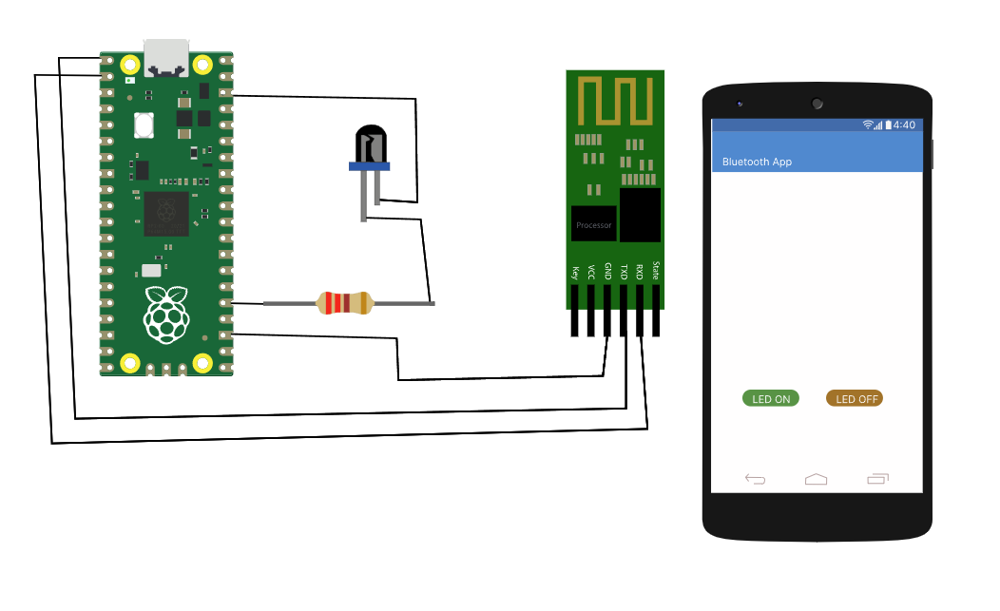

<h2>Procedure</h2>

 <h4>Hardware Setup</h4>
    <ul>
        <li>
                Connect the Vcc of HC-05 Bluetooth Sensor to pin to VBUS of
                Raspberry Pi Pico
              </li>
              <li>
                Connect the TX pin of HC-05 Bluetooth Sensor to GP0 pin of
                Raspberry Pi
              </li>
              <li>
                Connect the RX pin of HC-05 Bluetooth Sensor to GP1 Raspberry Pi
              </li>
              <li>
                Connect the GND pic of HC-05 Bluetooth Sensor to GND pin of
                Raspberry Pi Pico
              </li>
              <li>positive terminal of LED is coonected to Resistor</li>
              <li>
                The other terminal of reistor connected to GP19 pin of Raspberry
                Pi Pico
              </li>
              <li>
                Negative terminal of LED is coonected to GND pin of Raspberry Pi
                Pico
              </li>
              <li>
                Click the Bluetooth icon in the smart phone to turn on the
                bluetooth
              </li>
              <li>
                Turn on the bluetooth by Click the switch given in the smart
                phone screen
              </li>
              <li>Select Raspberry Pi from the Available devices</li>
              <li>
                After completing the Circuit and paring the bluetooth , user can
                Turn-On and Turn-Off the Led by clicking the button given in the
                smart phone
              </li>
    </ul>

        
    

<h4>Software Setup</h4>
    <ul>
        <li>We should download The Serial Bluetooth Terminal App from Google Play Store. When we open the app, we can see some buttons labelled as M1, M2, M3, and so on. We need to set up the M1 as LED ON and M2 as LED OFF button.</li>
    </ul>
    

        
    

    <ul>
        <li>We need to program the Pico board for Bluetooth communication by using the file main.py.</li>
        <li>First, open the "main.py" file in the Thonny IDE. To begin, use the "ctrl+shift+s" buttons on your keyboard to save the "main.py" file on the Pico board. Make sure your Pico board is connected to your laptop before saving the files. A popup window will display when you save the code.</li>
        <li>Select the Raspberry Pi Pico first, then name the file "main.py" and save it. This procedure allows you to run the software whenever you turn on the Pico.</li>
        <li>Now we must pair the app with our Bluetooth module. Verify that the code has been uploaded to the Pico board. When you turn on the Pico board, you can notice the Bluetooth module's LED blinking slowly.</li>
    </ul>
    

        
    

    <ul>
        <li>You can now press the "connection button," which is located in the top right corner of the program. A new window titled "Devices" will appear. You must first select your Bluetooth device. It was "Ble" in my situation, but it may be "HC-06" in yours. You will be linked to the Bluetooth module once you select the device.</li>
        <li>After connecting to Bluetooth and pressing the "Led ON" or "Led OFF" keys, you should be able to see the data as "1" or "0" on the terminal of the Android app.</li>
    </ul>
    

        
    

    <ul>
        <li>You can also notice that the LED turns on and off when you press the "led ON" and "led OFF" buttons. </li>
    </ul>

 <h4>Python Code</h4>
    <pre><code>

main.py:
from machine import Pin, UART
uart = UART(0, 9600)
LedGPIO = 16
led = Pin(LedGPIO, Pin.OUT)

while True:
if uart.any():
command = uart.readline() # print(command) # uncomment this line to see the received data
if command == b'\xd0':
led.high()
print("ON")
elif command == b'\xd5':
led.low()
print("OFF")
</code></pre>
