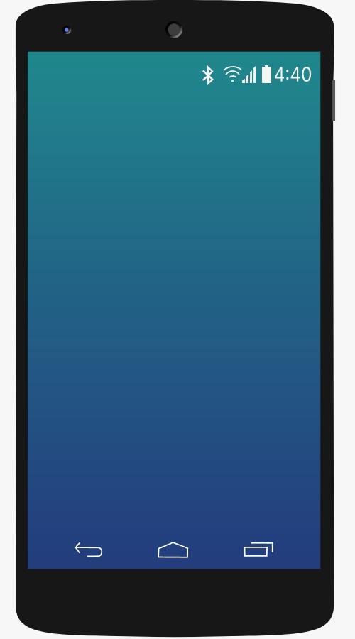

### Theory

#### Introduction
This experiment demonstrates how to control an LED using an Android application via Bluetooth. We will use the HC-05 Bluetooth module, which is easy to interface with microcontrollers and cost-effective. It operates using UART communication, allowing seamless connectivity between the Raspberry Pi Pico board and the Bluetooth module.

#### Components

#### 1. Bluetooth Module (HC-05)
The HC-05 is a Bluetooth module primarily used for wireless serial communication. It follows UART (Universal Asynchronous Receiver-Transmitter) protocol and is compatible with microcontrollers like Arduino, Raspberry Pi, and Raspberry Pi Pico. The module operates at a voltage of 3.3V to 5V and is commonly used in IoT applications.

#### 2. Raspberry Pi Pico
The **Raspberry Pi Pico** is a low-cost microcontroller board featuring flexible digital interfaces. It is powered by the **RP2040**, Raspberry Pi's first in-house microcontroller, which includes dual ARM Cortex-M0+ cores. The Pico supports various peripherals, including UART, SPI, and I2C, making it suitable for embedded applications.

Key features of the Raspberry Pi Pico:
- Equipped with **RP2040 microcontroller**
- Provides **USB reprogrammability** (drag-and-drop method)
- Operates at **3.3V** with an **on-board buck-boost SMPS** (1.8V to 5.5V input range)
- Features **26 GPIO pins** (including ADC, PWM, and serial communication interfaces)
- Supports debugging via **Serial Wire Debug (SWD)** interface

The board can be powered by multiple sources, such as a **single Lithium-Ion battery** or **three AA cells** in series. Additionally, external battery chargers can be integrated into the Pico’s power chain.

#### Why Raspberry Pi Pico?
The Raspberry Pi Pico is selected for this experiment over a full Raspberry Pi single-board computer due to its optimized design for embedded applications requiring basic hardware control and wireless communication. Unlike a Raspberry Pi, which operates a complete operating system suited for complex computing tasks, the Pico functions without an OS, enabling direct, real-time interaction with peripherals like the HC-05 Bluetooth module and the LED. This eliminates unnecessary overhead, ensuring efficient execution of simple tasks such as toggling an LED based on UART signals. Additionally, its low cost and minimal power requirements (operable via USB or small batteries at 3.3V) make it an economical and practical choice.
#### 3. LED
A **Light Emitting Diode (LED)** is used as an indicator in this experiment. It emits light when an electric current passes through it, providing a visual indication of system activity.

#### 4. Resistor
A **resistor** is used to limit the current flowing through the LED, preventing damage due to excessive current.

#### 5. Phone
A **smartphone** running an Android application will be used to send Bluetooth commands to the Raspberry Pi Pico. The app will communicate with the HC-05 Bluetooth module, allowing control of the LED remotely.

#### Circuit Connection
The components are connected as follows to enable wireless control of the LED via Bluetooth, with each connection serving a specific purpose:
- Connect the **Vcc of HC-05 Bluetooth Sensor to VBUS of Raspberry Pi Pico**.  
  This supplies the HC-05 with 5V power from the Pico’s VBUS pin, which is necessary for the module to operate and establish Bluetooth communication.
- Connect the **TX pin of HC-05 Bluetooth Sensor to GP0 pin of Raspberry Pi Pico**.  
  The TX (transmit) pin sends data from the HC-05 to the Pico’s GP0 (UART0 RX), enabling the microcontroller to receive commands from the smartphone.
- Connect the **RX pin of HC-05 Bluetooth Sensor to GP1 pin of Raspberry Pi Pico**.  
  The RX (receive) pin accepts data from the Pico’s GP1 (UART0 TX), allowing the Pico to send responses or status updates to the HC-05 for transmission to the smartphone.
- Connect the **GND pin of HC-05 Bluetooth Sensor to GND pin of Raspberry Pi Pico**.  
  This establishes a common ground between the HC-05 and Pico, ensuring stable voltage levels and proper operation of the circuit.
- Connect the **positive terminal of LED to a resistor**.  
  The resistor limits the current flowing into the LED, protecting it from burning out due to excessive current from the Pico’s GPIO pin.
- Connect the **other terminal of the resistor to GP19 pin of Raspberry Pi Pico**.  
  GP19, a general-purpose I/O pin, provides the voltage to turn the LED on or off based on the Pico’s program, controlled by Bluetooth signals.
- Connect the **negative terminal of LED to GND pin of Raspberry Pi Pico**.  
  This completes the LED circuit by connecting it to ground, allowing current to flow through the LED when GP19 is set high.
- **Click the Bluetooth icon in the smartphone to turn on the Bluetooth**.  
  Activating Bluetooth on the smartphone enables it to search for and connect to the HC-05 module for wireless communication.
- **Turn on the Bluetooth by clicking the switch given in the smartphone screen**.  
  This ensures the smartphone’s Bluetooth is fully enabled, a necessary step for pairing with the HC-05.
- **Select Raspberry Pi from the Available devices**.  
  Pairing the smartphone with the HC-05 (named "Raspberry Pi" or similar) establishes the communication link needed to send LED control commands.
- **After completing the circuit and pairing the Bluetooth, the user can Turn-On and Turn-Off the LED by clicking the button given in the smartphone**.  
  This final step allows the smartphone app to send '1' or '0' signals via Bluetooth, which the Pico interprets to control the LED state.

This setup enables wireless control of the LED via Bluetooth, making it a simple yet effective introduction to IoT-based projects.