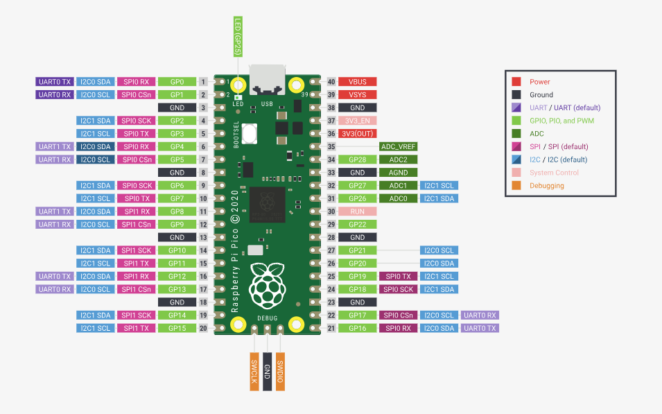

### Theory
In This tutorial we are going to control an LED with an Android app using Bluetooth and Micro Python.
We are Using HC-06 Bluetooth module it is easy to interface with micro controllers and it is very cheap it is generally implemented using UART Communication so we are going to make a connection between pico board and the bluetooth.
Components used in this experiment are – 
* Bluetooth Module HC-05
* Raspberry Pi Pico Board
* LED
* 220 Ohm Resister
* Connecting wires

<h4> Raspberry Pi Pico </h4>
The Raspberry Pi Pico is a low-cost microcontroller board with flexible digital interfaces. It includes the RP2040, Raspberry Pi's first in-house built microcontroller. Pico supports the RP2040 chip with minimum (but flexible) additional circuitry (Flash, crystal, power supplies and decoupling and USB connector). The majority of the RP2040 microcontroller pins are connected to the user IO pins on the board's left and right edges. Four RP2040 IO are used for internal functions such as driving an LED, controlling the on-board Switched Mode Power Supply (SMPS), and monitoring system voltages.
Pico employs an on-board buck-boost SMPS capable of producing the requisite 3.3 volts (to power the RP2040 and external circuits) from a wide range of input voltages (1.8 to 5.5V). This provides substantial flexibility in charging the unit from a variety of sources, such as a single Lithium-Ion battery or three AA cells connected in series. Battery chargers can be simply added into the Pico powerchain as well. The Pico's flash memory can be reprogrammed through USB (drag and drop a file onto the Pico, which looks as a mass storage device) or the Serial Wire Debug (SWD) interface. The SWD port can also be used to debug code running on the RP2040 interactively.
Pico is intended to be used with either soldered 0.1" pin-headers (it is one 0.1" pitch wider than a normal 40-pin DIP package) or as a surface mountable "module," as the user IO pins are likewise castellated. If utilised as a reflow-soldered SMT module, there are SMT pads beneath the USB connector and BOOTSEL button that allow these signals to be accessed.
 

